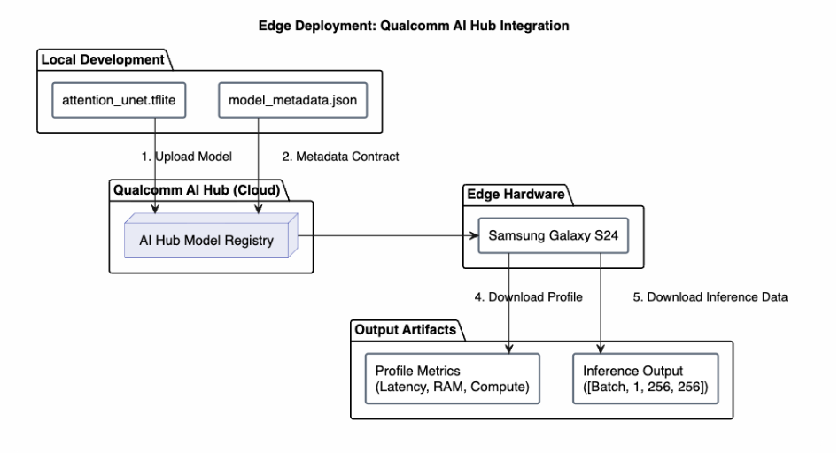
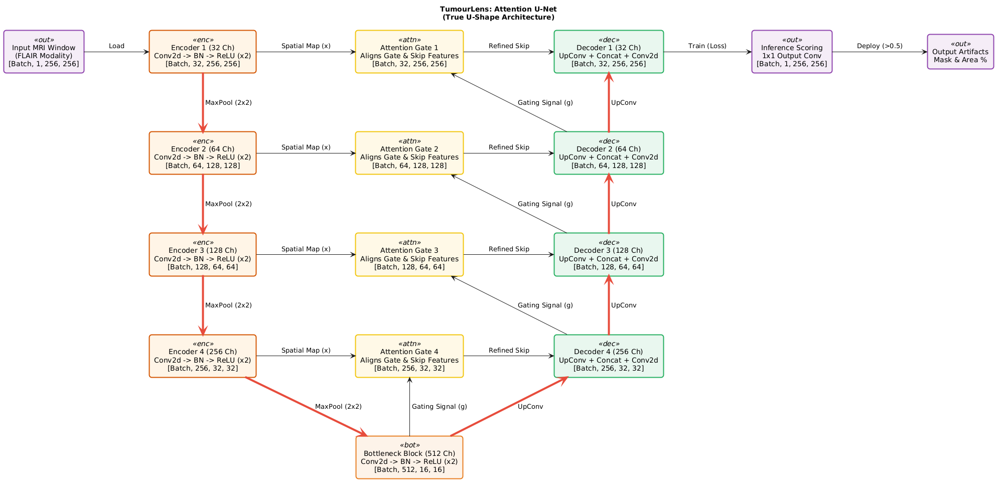
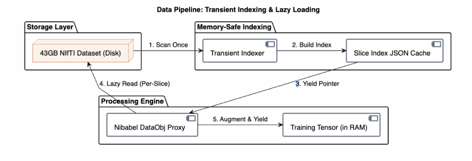
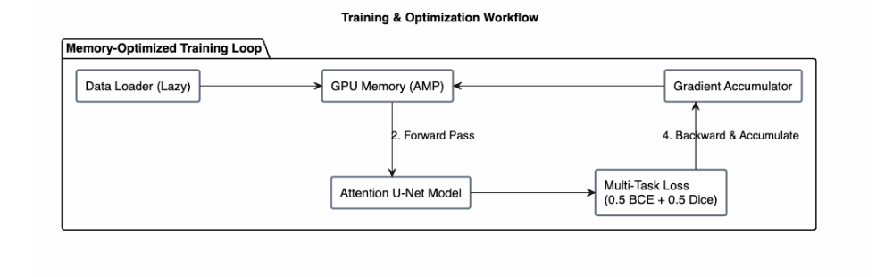

**PROJECT DOCUMENTATION**

**TumourLens**\
Spatio-Temporal Attention U-Net

------------------------------------------------------------------------

High-precision Brain Tumor Segmentation optimized for memory-constrained
training and accelerated edge deployment via Qualcomm AI Hub.

**TUMOURLENS**

**Executive Summary**

TumourLens is an end-to-end deep learning pipeline designed to segment
brain tumors from MRI scans. By integrating Attention Gates into a
classic U-Net architecture, the model learns to actively suppress
irrelevant background tissue.

The project solves two major hardware bottlenecks:

**1. Training Constraint:** Processes the massive 43GB BraTS2020 dataset
on strict GPU limits (e.g., 16GB) using zero-RAM lazy loading.\
**2. Deployment Constraint:** Profiles and executes the model directly
on edge hardware (Samsung Galaxy S24) utilizing the Qualcomm AI Hub API
for mobile-ready inference.

**Edge Deployment: Qualcomm AI Hub Integration**

To prove real-world viability, TumourLens doesn't just stop at a PyTorch
weights file. The model is exported to TensorFlow Lite and deployed
directly to physical Snapdragon-powered devices via the Qualcomm AI Hub
(`qai_hub`).

- **Direct Artifact Profiling:** Bypassing compilation steps, the
  pre-exported .tflite model is pushed directly to the hub.
  `submit_profile_job()` extracts estimated inference times, peak memory
  usage, and compute unit breakdowns directly from the Snapdragon
  silicon.

- **On-Device Execution:** `submit_inference_job()` pushes a strictly
  formatted dummy input (governed by `model_metadata.json`) to the
  phone.

- **Post-Processing:** The raw device output is pulled back locally,
  where sigmoid activations and dynamic thresholding ($>0.5$) generate
  the final `binary_mask.npy` and calculate the clinical
  `tumor_area_pct`.

**FIGURE**

**Edge Deployment: Qualcomm AI Hub Integration**

{width="\\linewidth"}

*The Qualcomm AI Hub deployment pipeline: local artifacts are uploaded
to the AI Hub Model Registry, executed on Edge Hardware (Samsung Galaxy
S24), and profiling and inference outputs are downloaded for
post-processing.*

**Core Architecture (The "U-Shape")**

The backbone of TumourLens is a symmetrical contracting and expanding
network, bridged by additive attention mechanisms.

{width="\\linewidth"}

*The comprehensive Spatio-Temporal topology detailing tensor
transformations from the 1x256x256 input slice to the final inference
scoring panel.*

- **The Encoder (Contracting Path):** Four blocks of standard Conv2D
  $\rightarrow$ BatchNorm $\rightarrow$ ReLU layers. Each block doubles
  the feature channels while halving spatial dimensions via
  MaxPool(2x2).

- **Attention Gates (The Filter):** A gating signal ($g$) from the
  lower, context-rich layer determines which spatial features ($x$) from
  the encoder are actually relevant, suppressing healthy tissue
  activations.

- **The Decoder (Expanding Path):** Bilinear UpConv layers scale the
  spatial dimensions back up, concatenating with the filtered skip
  connections to precisely localize the tumor boundaries.

**Data Pipeline & Memory Management**

Loading thousands of 3D NIfTI volumes into RAM is impossible on standard
edge or cloud hardware. TumourLens solves this using a **Transient
Indexing** and **Lazy Loading** workflow.

- **Index Generation:** The system rapidly scans the 3D files to find
  slices containing minimum brain pixels, saving a lightweight JSON map.

- **Zero-RAM Fetching:** During training, `nibabel.dataobj` acts as a
  proxy, fetching only the specific 2D slice directly from the hard
  drive.

{width="\\linewidth"}

*Data Pipeline: Transient Indexing & Lazy Loading --- from the 43GB
NIfTI dataset on disk, through index generation, to per-slice lazy reads
augmented into training tensors.*

**Training & Optimization Workflow**

To maximize batch sizes without crashing the GPU, the training loop
utilizes **Automatic Mixed Precision (AMP)** and **Gradient
Accumulation** (Effective Batch = 32).

Because tumors often occupy a very small percentage of the total brain
scan, TumourLens utilizes a hybrid loss:

$L_{total} = 0.5 \cdot L_{BCE} + 0.5 \cdot L_{Dice}$

- **BCE (Binary Cross-Entropy):** Penalizes strict pixel-wise
  classification errors.

- **Dice Loss:** Maximizes the spatial intersection-over-union (IoU)
  overlap between the prediction and the ground truth.

{width="\\linewidth"}

*Memory-Optimized Training Loop: the lazy Data Loader feeds GPU memory
under AMP, the Attention U-Net Model runs the forward pass into the
Multi-Task Loss, and gradients are accumulated before the backward
step.*

**Quick Start Guide**

    git clone https://github.com/your-username/tumourlens.git
    cd tumourlens
    pip install -r requirements.txt
    pip install qai-hub  # Qualcomm AI Hub SDK

Ensure you have configured your AI Hub API token, then run the
deployment script to push the .tflite model to a physical device:

    python scripts/deploy_to_qai_hub.py

*Outputs will be saved in `qai_hub_export/`, including
`profile_results.json` and `binary_mask.npy`.*

- Update the `DATA_ROOT` path in `CFG` to point to your BraTS2020
  dataset.

- Run the training notebook. It will automatically build the index,
  train the model using AMP, and output `attention_unet_inference.pth`.

**Contributors**

- [Vrajesh Sharma](https://github.com/Vrajesh-Sharma)

- [Krina Parmar ](https://github.com/krina2005)

- [Hardik Manglani](https://github.com/Hardik21806)
